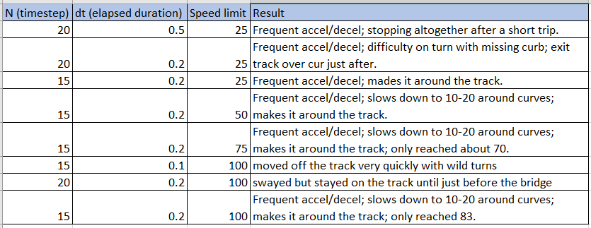

# CarND-Controls-MPC
Self-Driving Car Engineer Nanodegree Program
---
## Project Description

This repo contains the implementation of a Model Predictive Controller (MPC) used to drive a car around a track in a Unity simulator.

## The Model
### State
The state is represented as a vector of 6 elements -- x, y, v, psi, cte, epsi.

| Element | Description |
|:-------------:|:------------------------:|
|x | horizontal position of the car|
|y | vertical position of the car|
|psi| orientation of the car in radians|
|v| velocity of the car|
|cte| cross track error|
|epsi| error with respect to psi|

### Actuators
The actuators are represented as a vector of 2 elements -- delta, a.

| Element | Description |
|:-------------:|:------------------------:|
|delta | steering angle|
|a | acceleration|

### Update Equations
x is determined by multiplying the velocity by the change in time by the cosine of psi
>x = x1 - (x0 + v0 * cos(psi0) *dt)

x is determined by mulitplying the velocity by the change in time by the sin of psi
>y = y1 - (y0 + v0 * sin(psi0) *dt)

Psi is determined by mulitplying the velocity by the change in time by the steering angle divided by Lf.  Lf is the distance between the front of the vehicle and its center of gravity. 
>psi = psi1 - (psi0 - v0 * delta0 / Lf*dt)

Velocity is determined by acceleration multiplied by the change in time.
>v = v1 - (v0 + a0 * dt)

Cross track error is determined by the sine of the psi error multiplied by velocity multipled by the change in time.
>cte = cte1 - ((f0 - y0) + (v0 * sin(epsi0) *dt))

Psi error is determined by velocity multipled by the change time multiplied by the steering angle divided by Lf.  Lf is the distance between the front of the vehicle and its center of gravity.
>epsi = epsi1 - ((psi0 - psides0) - v0 * delta0 / Lf * dt)
## Timestep Length and Elapsed Duration
I experimented with differnet timestep/duration combinations as documented in the table below.  I settled on the final row which produced the fastest maximum speed while allowing the car to make it around the track.



## Latency
Latency is implemented by pausing the executing thread for 100 miliseconds.

## Dependencies

* cmake >= 3.5
 * All OSes: [click here for installation instructions](https://cmake.org/install/)
* make >= 4.1(mac, linux), 3.81(Windows)
  * Linux: make is installed by default on most Linux distros
  * Mac: [install Xcode command line tools to get make](https://developer.apple.com/xcode/features/)
  * Windows: [Click here for installation instructions](http://gnuwin32.sourceforge.net/packages/make.htm)
* gcc/g++ >= 5.4
  * Linux: gcc / g++ is installed by default on most Linux distros
  * Mac: same deal as make - [install Xcode command line tools]((https://developer.apple.com/xcode/features/)
  * Windows: recommend using [MinGW](http://www.mingw.org/)
* [uWebSockets](https://github.com/uWebSockets/uWebSockets)
  * Run either `install-mac.sh` or `install-ubuntu.sh`.
  * If you install from source, checkout to commit `e94b6e1`, i.e.
    ```
    git clone https://github.com/uWebSockets/uWebSockets 
    cd uWebSockets
    git checkout e94b6e1
    ```
    Some function signatures have changed in v0.14.x. See [this PR](https://github.com/udacity/CarND-MPC-Project/pull/3) for more details.
* Fortran Compiler
  * Mac: `brew install gcc` (might not be required)
  * Linux: `sudo apt-get install gfortran`. Additionall you have also have to install gcc and g++, `sudo apt-get install gcc g++`. Look in [this Dockerfile](https://github.com/udacity/CarND-MPC-Quizzes/blob/master/Dockerfile) for more info.
* [Ipopt](https://projects.coin-or.org/Ipopt)
  * If challenges to installation are encountered (install script fails).  Please review this thread for tips on installing Ipopt.
  * Mac: `brew install ipopt`
       +  Some Mac users have experienced the following error:
       ```
       Listening to port 4567
       Connected!!!
       mpc(4561,0x7ffff1eed3c0) malloc: *** error for object 0x7f911e007600: incorrect checksum for freed object
       - object was probably modified after being freed.
       *** set a breakpoint in malloc_error_break to debug
       ```
       This error has been resolved by updrading ipopt with
       ```brew upgrade ipopt --with-openblas```
       per this [forum post](https://discussions.udacity.com/t/incorrect-checksum-for-freed-object/313433/19).
  * Linux
    * You will need a version of Ipopt 3.12.1 or higher. The version available through `apt-get` is 3.11.x. If you can get that version to work great but if not there's a script `install_ipopt.sh` that will install Ipopt. You just need to download the source from the Ipopt [releases page](https://www.coin-or.org/download/source/Ipopt/).
    * Then call `install_ipopt.sh` with the source directory as the first argument, ex: `sudo bash install_ipopt.sh Ipopt-3.12.1`. 
  * Windows: TODO. If you can use the Linux subsystem and follow the Linux instructions.
* [CppAD](https://www.coin-or.org/CppAD/)
  * Mac: `brew install cppad`
  * Linux `sudo apt-get install cppad` or equivalent.
  * Windows: TODO. If you can use the Linux subsystem and follow the Linux instructions.
* [Eigen](http://eigen.tuxfamily.org/index.php?title=Main_Page). This is already part of the repo so you shouldn't have to worry about it.
* Simulator. You can download these from the [releases tab](https://github.com/udacity/self-driving-car-sim/releases).
* Not a dependency but read the [DATA.md](./DATA.md) for a description of the data sent back from the simulator.


## Basic Build Instructions

1. Clone this repo.
2. Make a build directory: `mkdir build && cd build`
3. Compile: `cmake .. && make`
4. Run it: `./mpc`.

## Project Instructions and Rubric

More information is only accessible by people who are already enrolled in Term 2
of CarND. If you are enrolled, see [the project page](https://classroom.udacity.com/nanodegrees/nd013/parts/40f38239-66b6-46ec-ae68-03afd8a601c8/modules/f1820894-8322-4bb3-81aa-b26b3c6dcbaf/lessons/b1ff3be0-c904-438e-aad3-2b5379f0e0c3/concepts/1a2255a0-e23c-44cf-8d41-39b8a3c8264a)
for instructions and the project rubric.
